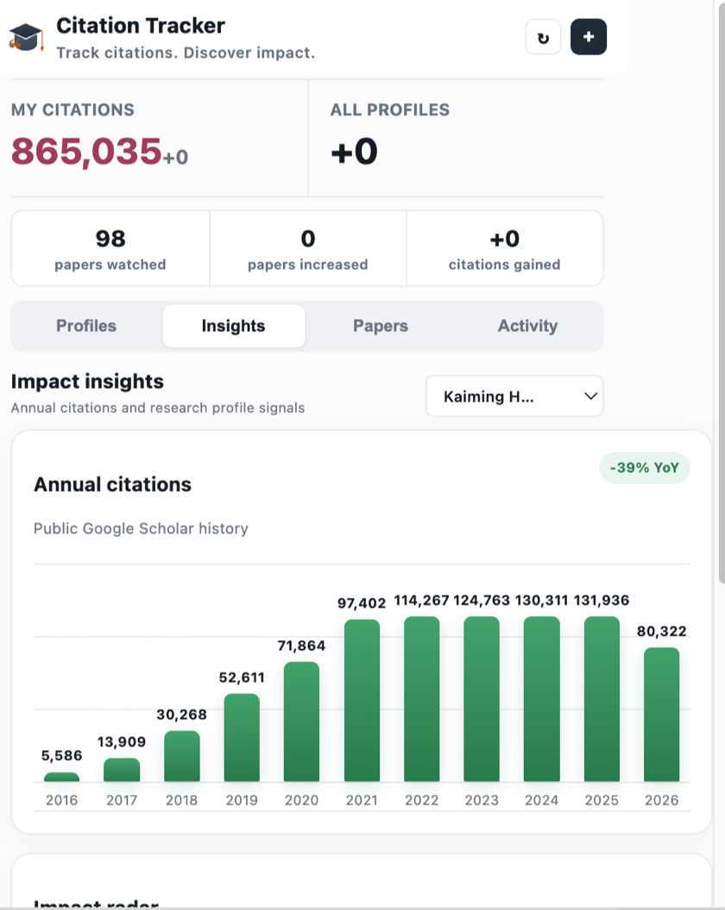

<div align="center">


# Citation Tracker

**Track citations. Discover impact.**

A privacy-friendly Chrome extension that monitors Google Scholar citation totals and shows exactly which papers gained citations.

[](https://chromewebstore.google.com/detail/citation-tracker/fklkbgfognmpjiaflembdklibehgifkm)
[](https://jaychempan.github.io/citation-tracker)
[](LICENSE)



</div>

---

## Features

- **Article-Level Monitoring** - See which papers gained citations on each refresh
- **Scholar-Style Paper Browser** - Browse cached papers with citation counts, local filtering, profile filters, sorting, incremental loading, and a direct Scholar online search
- **Detailed Activity** - Review authors, publication, year, before-and-after counts, and Scholar links
- **Annual Citation Trends** - Visualize public Scholar history with year-over-year change
- **Impact Radar** - Compare normalized citation, index, reach, and momentum signals
- **Local History** - Keeps up to 200 recent citation events from the last 180 days
- **Auto Refresh** - Citation totals and papers update every 30 minutes
- **Multi Profile** - Track your own profile and watch others in one popup
- **Offline Resilient** - Preserves previous snapshots when Google Scholar or the network fails

The first successful refresh creates a paper baseline. Later refreshes compare each paper by its stable Google Scholar citation ID, so existing citations are not reported as new activity.

## Install

### Chrome Web Store

Install directly from the Chrome Web Store:

<div align="center">
  <a href="https://chromewebstore.google.com/detail/citation-tracker/fklkbgfognmpjiaflembdklibehgifkm" target="_blank" rel="noopener">
    
  </a>
</div>

### Developer Mode

1. Clone this repo
   ```bash
   git clone https://github.com/jaychempan/citation-tracker.git
   ```
2. Open Chrome and go to `chrome://extensions`
3. Enable **Developer mode** (top right toggle)
4. Click **Load unpacked** and select the `chrome` directory
5. Done - the Citation Tracker icon appears in your toolbar

## Usage

1. Click the toolbar icon
2. Enter your Google Scholar user ID

   > Find it from your profile URL:
   > `scholar.google.com/citations?user=`**DhtAFkwAAAAJ**`&hl=en`

3. Optionally add other Scholar IDs to track
4. Click **Save** - the first refresh creates the article baseline
5. Open **Papers** to browse cached publications and their citation counts
6. Open **Activity** after a later refresh to see which papers gained citations

All profile IDs, article snapshots, and citation history remain in `chrome.storage.local` on your device.

## Troubleshooting

If the first refresh says Google Scholar could not be checked:

1. Use **Open Scholar profile** in the error panel.
2. Confirm that `scholar.google.com` loads in Chrome and complete any Google verification page.
3. Return to the extension and click refresh.

The extension stops Scholar-to-Google verification redirects before they trigger a cross-origin error. After you complete verification in a normal tab, the next refresh reuses that browser session. It does not request access to `www.google.com`.

The extension reports timeouts, HTTP 403/429 responses, verification redirects or pages, invalid profile IDs, and parsing failures separately. If the profile summary loads but expanded article pagination is blocked, citation totals and the visible article baseline are still preserved with a **Partial coverage** notice.

## Project Structure

```
citation-tracker/
├── chrome/              # Chrome extension
│   ├── background.js    # Service worker
│   ├── popup.html       # Popup UI
│   ├── popup.js         # Popup logic
│   ├── popup.css        # Popup styles
│   ├── manifest.json    # Extension manifest
│   └── icons/           # Extension icons
├── tests/               # Parser and citation-diff tests
├── website/             # Landing page (GitHub Pages)
│   ├── index.html
│   ├── style.css
│   ├── i18n.js
│   ├── logo.svg
│   └── preview_v1.4@2x.png
├── package.json         # Local test commands
└── .github/workflows/   # CI/CD
    ├── deploy.yml       # GitHub Pages auto-deploy
    └── test.yml         # Extension tests and syntax checks
```

## Related

- [CCF DDL Tracker](https://jianchengpan.space/ccf-ddl-tracker/) - Track CCF conference deadlines

## License

[MIT](LICENSE)
