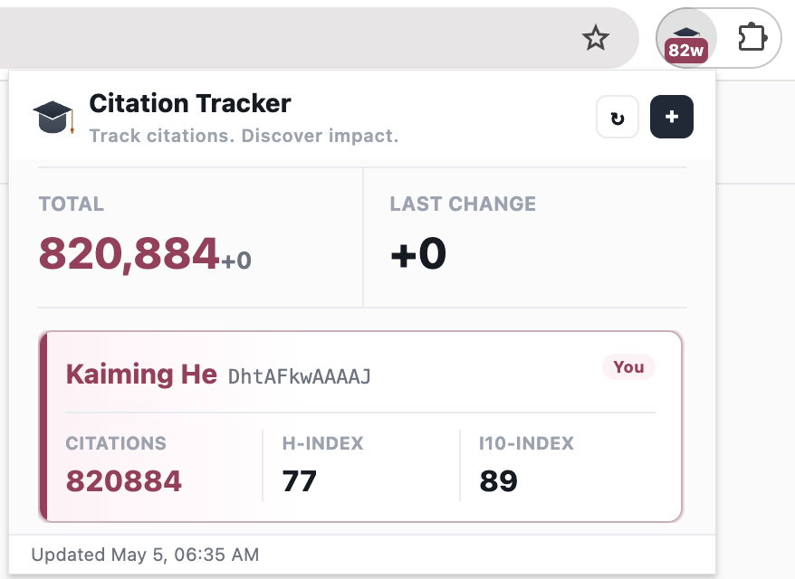

<div align="center">


# Citation Tracker

**Track citations. Discover impact.**

A minimal Chrome extension that monitors your Google Scholar citations — right from the toolbar.

[](https://chromewebstore.google.com/detail/citation-tracker/fklkbgfognmpjiaflembdklibehgifkm)
[](https://jaychempan.github.io/citation-tracker)
[](LICENSE)



</div>

---

## Features

- **Auto Refresh** — Citations update every 30 minutes, no manual checks needed
- **Badge Count** — Your citation count is always visible in the toolbar badge
- **Multi Profile** — Track your own profile and watch others in one popup
- **Delta Tracking** — See citation changes since last update at a glance
- **Offline Resilient** — Preserves previous data when network fails

## Install

### Chrome Web Store

Install directly from the Chrome Web Store:

<div align="center">
  <a href="https://chromewebstore.google.com/detail/citation-tracker/fklkbgfognmpjiaflembdklibehgifkm" target="_blank" rel="noopener">
    
  </a>
</div>

### Developer Mode

1. Clone this repo
   ```bash
   git clone https://github.com/jaychempan/citation-tracker.git
   ```
2. Open Chrome and go to `chrome://extensions`
3. Enable **Developer mode** (top right toggle)
4. Click **Load unpacked** and select the `chrome` directory
5. Done — the Citation Tracker icon appears in your toolbar

## Usage

1. Click the toolbar icon
2. Enter your Google Scholar user ID

   > Find it from your profile URL:
   > `scholar.google.com/citations?user=`**DhtAFkwAAAAJ**`&hl=en`

3. Optionally add other Scholar IDs to track
4. Click **Save** — citations refresh automatically

## Project Structure

```
citation-tracker/
├── chrome/              # Chrome extension
│   ├── background.js    # Service worker
│   ├── popup.html       # Popup UI
│   ├── popup.js         # Popup logic
│   ├── popup.css        # Popup styles
│   ├── manifest.json    # Extension manifest
│   └── icons/           # Extension icons
├── website/             # Landing page (GitHub Pages)
│   ├── index.html
│   ├── style.css
│   ├── i18n.js
│   ├── logo.svg
│   └── preview_v1.1.png
└── .github/workflows/   # CI/CD
    └── deploy.yml       # GitHub Pages auto-deploy
```

## Related

- [CCF DDL Tracker](https://jianchengpan.space/ccf-ddl-tracker/) — Track CCF conference deadlines

## License

[MIT](LICENSE)