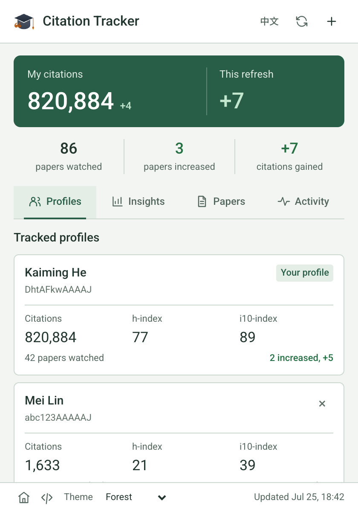

<div align="center">


# Citation Tracker

**Track citations. Discover impact.**

A privacy-friendly Chrome extension that monitors Google Scholar citation totals and shows exactly which papers gained citations.

[简体中文说明](README.zh-CN.md)

[](https://chromewebstore.google.com/detail/citation-tracker/fklkbgfognmpjiaflembdklibehgifkm)
[](https://jaychempan.github.io/citation-tracker)
[](LICENSE)



[v1.5.0 package](https://jaychempan.github.io/citation-tracker/downloads/citation-tracker-1.5.0.zip) · [Changelog](CHANGELOG.md)

</div>

---

## Features

- **Article-Level Monitoring** - See which papers gained citations on each refresh
- **Scholar-Style Paper Browser** - Browse cached papers with citation counts, local filtering, profile filters, sorting, incremental loading, and a direct Scholar online search
- **Detailed Activity** - Review authors, publication, year, before-and-after counts, and Scholar links
- **Annual Citation Trends** - Visualize public Scholar history; year-over-year change compares consecutive completed years, with the current year marked as year to date
- **Impact Radar** - Compare normalized citation, index, reach, and momentum signals, with expandable explanations of paper reach and momentum
- **Local History** - Keeps up to 200 recent citation events from the last 180 days
- **Auto Refresh** - Citation totals and papers update every 30 minutes
- **Multi Profile** - Track your own profile and watch others in one popup
- **Offline Resilient** - Preserves previous snapshots when Google Scholar or the network fails
- **English & Simplified Chinese** - Follows your browser language on first use; switch with the **中文 / EN** button and keep your preference locally
- **Theme Choices** - Choose Forest or Graphite in the popup footer; both follow system light/dark appearance and save your selection locally

Product names, standard metrics (`h-index` and `i10-index`), and original paper metadata keep their original wording in both languages.

Paper reach is the cited share of synced papers. Momentum uses the latest two consecutive completed years; a year cached before it ended remains excluded from full-year comparisons until refreshed.

The first successful refresh creates a paper baseline. Later refreshes compare each paper by its stable Google Scholar citation ID, so existing citations are not reported as new activity.

## Install

### Chrome Web Store

Install directly from the Chrome Web Store:

<div align="center">
  <a href="https://chromewebstore.google.com/detail/citation-tracker/fklkbgfognmpjiaflembdklibehgifkm" target="_blank" rel="noopener">
    
  </a>
</div>

### Developer Mode

Download and unzip the [v1.5.0 package](https://jaychempan.github.io/citation-tracker/downloads/citation-tracker-1.5.0.zip), then load the extracted folder containing `manifest.json`. The Chrome Web Store currently lists v1.4.0; the new package needs a separate store submission and review.

Alternatively, install from source:

1. Clone this repo
   ```bash
   git clone https://github.com/jaychempan/citation-tracker.git
   ```
2. Open Chrome and go to `chrome://extensions`
3. Enable **Developer mode** (top right toggle)
4. Click **Load unpacked** and select the `chrome` directory
5. Done - the Citation Tracker icon appears in your toolbar

## Usage

1. Click the toolbar icon
2. Enter your Google Scholar user ID

   > Find it from your profile URL:
   > `scholar.google.com/citations?user=`**DhtAFkwAAAAJ**`&hl=en`

3. Optionally add other Scholar IDs to track
4. Click **Save** - the first refresh creates the article baseline
5. Open **Papers** to browse cached publications and their citation counts
6. Open **Activity** after a later refresh to see which papers gained citations
7. Use **中文 / EN** in the popup header to switch the interface language
8. Choose **Forest / Graphite** in the footer to change themes

All profile IDs, article snapshots, citation history, and language/theme preferences remain in `chrome.storage.local` on your device. To update an existing developer-mode installation, replace the files in its extension folder and click **Reload** at `chrome://extensions`.

## Troubleshooting

If the first refresh says Google Scholar could not be checked:

1. Use **Open Scholar profile** in the error panel.
2. Confirm that `scholar.google.com` loads in Chrome and complete any Google verification page.
3. Return to the extension and click refresh.

The extension stops Scholar-to-Google verification redirects before they trigger a cross-origin error. After you complete verification in a normal tab, the next refresh reuses that browser session. It does not request access to `www.google.com`.

The extension reports timeouts, HTTP 403/429 responses, verification redirects or pages, invalid profile IDs, and parsing failures separately. If the profile summary loads but expanded article pagination is blocked, citation totals and the visible article baseline are still preserved with a **Partial paper list** notice.

## Project Structure

```
citation-tracker/
├── chrome/              # Chrome extension
│   ├── background.js    # Service worker
│   ├── popup.html       # Popup UI
│   ├── popup.js         # Popup logic
│   ├── popup.css        # Popup styles
│   ├── i18n.js          # English and Simplified Chinese UI messages
│   ├── _locales/        # Localized Chrome extension metadata
│   ├── manifest.json    # Extension manifest
│   └── icons/           # Extension icons
├── tests/               # Parser and citation-diff tests
├── website/             # Landing page (GitHub Pages)
│   ├── index.html
│   ├── style.css
│   ├── i18n.js
│   ├── logo.svg
│   ├── script.js        # Theme screenshot comparison
│   ├── screenshots/     # Current English/Chinese theme previews
│   └── downloads/       # Versioned extension archive
├── scripts/             # Reproducible extension packaging
├── CHANGELOG.md         # Release notes
├── package.json         # Local test commands
└── .github/workflows/   # CI/CD
    ├── deploy.yml       # GitHub Pages auto-deploy
    └── test.yml         # Extension tests and syntax checks
```

## Related

- [CCF DDL Tracker](https://jianchengpan.space/ccf-ddl-tracker/) - Track CCF conference deadlines

## License

[MIT](LICENSE)
